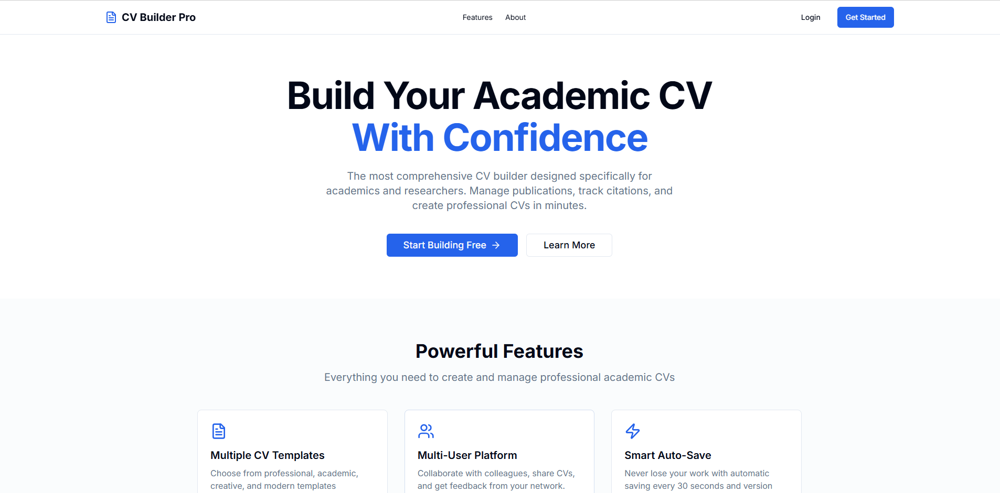
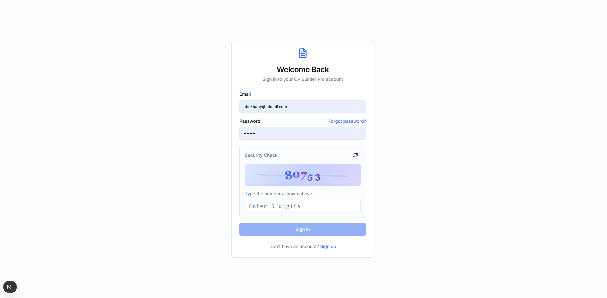
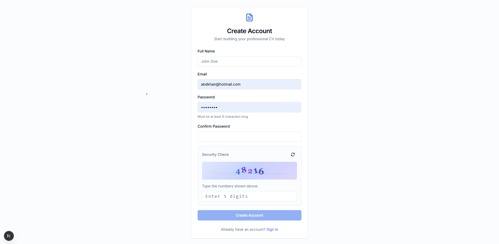
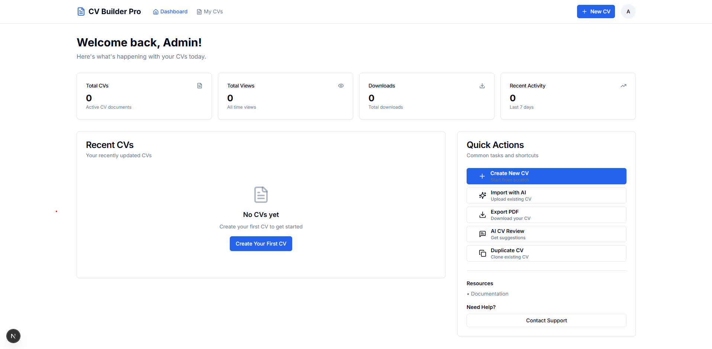
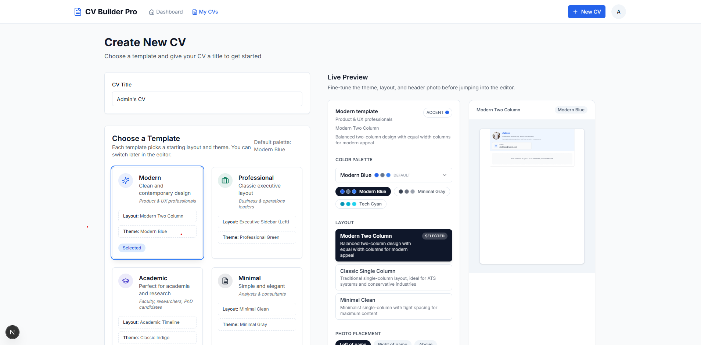
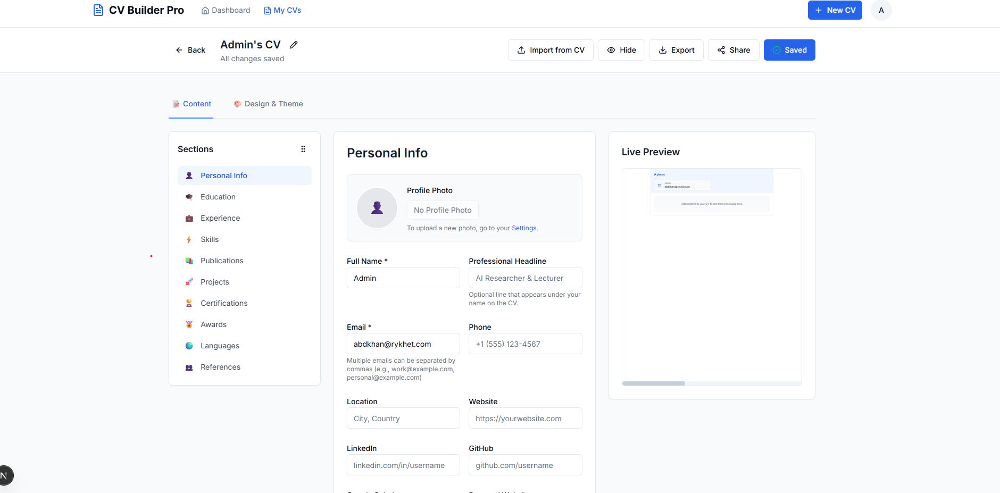
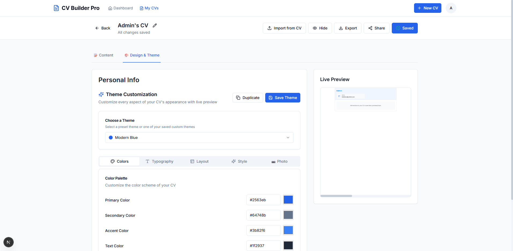

# 🎓 CV Builder Pro

```
 ██████╗██╗   ██╗    ██████╗ ██╗   ██╗██╗██╗     ██████╗ ███████╗██████╗
██╔════╝██║   ██║    ██╔══██╗██║   ██║██║██║     ██╔══██╗██╔════╝██╔══██╗
██║     ██║   ██║    ██████╔╝██║   ██║██║██║     ██║  ██║█████╗  ██████╔╝
██║     ╚██╗ ██╔╝    ██╔══██╗██║   ██║██║██║     ██║  ██║██╔══╝  ██╔══██╗
╚██████╗ ╚████╔╝     ██████╔╝╚██████╔╝██║███████╗██████╔╝███████╗██║  ██║
 ╚═════╝  ╚═══╝      ╚═════╝  ╚═════╝ ╚═╝╚══════╝╚═════╝ ╚══════╝╚═╝  ╚═╝
```

> **Professional Academic CV Builder Platform** - Create stunning CVs with AI assistance, multiple themes, and advanced sharing capabilities.

[](https://github.com/abdkhanstd/cvbuilderpro)
[](https://nextjs.org/)
[](https://www.typescriptlang.org/)
[](https://www.prisma.io/)

## ✨ Features

### 🤖 AI-Powered Features
- **AI Content Suggestions**: Get intelligent suggestions for improving your CV content
- **AI CV Review**: Comprehensive AI-powered review and feedback on your CV
- **AI-Based CV Imports**: Import and enhance CVs from previous versions with AI assistance
- **Smart Content Generation**: AI helps generate professional descriptions and summaries

### 📝 CV Creation & Editing
- **Rich Text Editor**: Professional editor for creating academic CVs
- **Drag-and-Drop Sections**: Easily reorder and customize CV sections
- **Real-time Preview**: Live preview of changes as you edit
- **Multiple Layouts**: Choose from various professional layouts

### 🔄 Import & Export
- **BibTeX Import**: Import publications directly from BibTeX files
- **Google Scholar Import**: Sync publications from Google Scholar
- **Multiple Export Formats**: Export to PDF, DOCX, HTML, and more
- **High-Quality PDF Generation**: Professional PDF output with proper formatting

### 🎨 Customization
- **Theme Collection**: Extensive library of customizable CV themes
- **Advanced Theme Editor**: Create custom themes with colors and fonts
- **Photo Upload & Editing**: Upload and crop profile photos
- **Responsive Design**: Optimized for desktop and mobile devices

### 🔗 Sharing & Collaboration
- **CV Sharing System**: Share CVs with unique links and QR codes
- **Public Access Control**: Set privacy levels for shared CVs
- **Download Permissions**: Control who can download your shared CVs
- **View Tracking**: Monitor views and downloads of shared CVs

### 🔐 Security & Administration
- **User Authentication**: Secure login with email verification
- **Admin Dashboard**: Comprehensive admin panel for system management
- **Captcha Integration**: Built-in spam protection
- **Email Notifications**: Automated verification and notification emails

## 📸 Screenshots

### Dashboard Overview


### CV Editor Interface


### Theme Selection


### AI Suggestions


### CV Preview


### Admin Panel


### Sharing Features


## 🚀 Quick Start

### Prerequisites
- Node.js 18.17.0 or higher
- Database (PostgreSQL recommended, SQLite for development)

### Installation

1. **Clone the repository:**
   ```bash
   git clone https://github.com/abdkhanstd/cvbuilderpro.git
   cd cvbuilderpro
   ```

2. **Install dependencies:**
   ```bash
   npm install
   ```

3. **Set up the database:**
   ```bash
   # Configure database connection in .env.local
   npm run db:migrate
   npm run db:generate
   npm run db:push
   npx prisma db seed
   ```

4. **Configure environment variables:**
   Create `.env.local` with required variables (database URL, NextAuth secret, etc.)

5. **Start the development server:**
   ```bash
   npm run dev
   ```

6. **Open your browser:**
   Visit [http://localhost:3000](http://localhost:3000)

## 👨‍💼 Admin Access

Default admin account (created during seeding):
- **Email:** abdkhan@rykhet.com
- **Password:** demo

## 🛠️ Tech Stack

- **Framework:** Next.js 15.5.2
- **Language:** TypeScript
- **Database:** Prisma ORM with SQLite/PostgreSQL
- **Authentication:** NextAuth.js
- **Styling:** Tailwind CSS
- **PDF Generation:** React PDF
- **AI Integration:** OpenAI API
- **Deployment:** Vercel/Railway/Cloudflare

## 📖 Usage Guide

1. **Sign Up/Login** - Create an account or log in
2. **Create CV** - Use the editor to build your professional CV
3. **AI Enhancement** - Get AI suggestions and reviews
4. **Customize Theme** - Choose from themes or create custom ones
5. **Import Data** - Import publications from BibTeX or Google Scholar
6. **Share & Export** - Share your CV or export in multiple formats

## 🤝 Contributing

Contributions are welcome! Please feel free to submit a Pull Request.

## 📧 Support

For support or inquiries: abdkhan@rykhet.com

## 📄 License

This project is licensed under the MIT License.

---

**Made with ❤️ for the academic community**

This project is private.